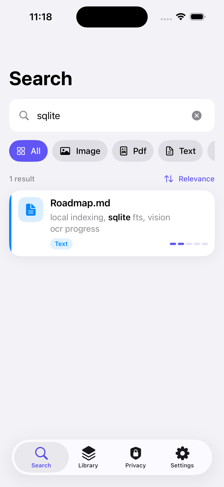
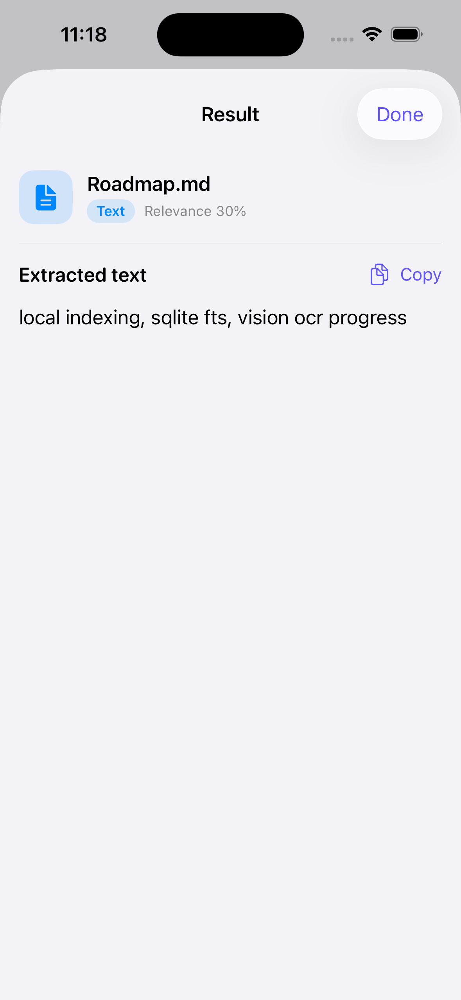
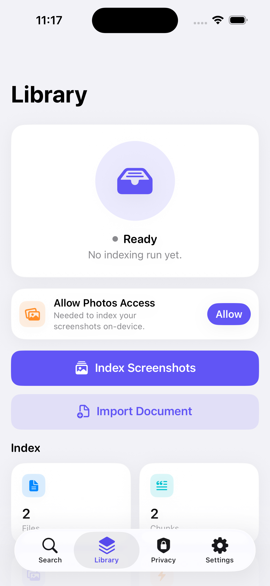
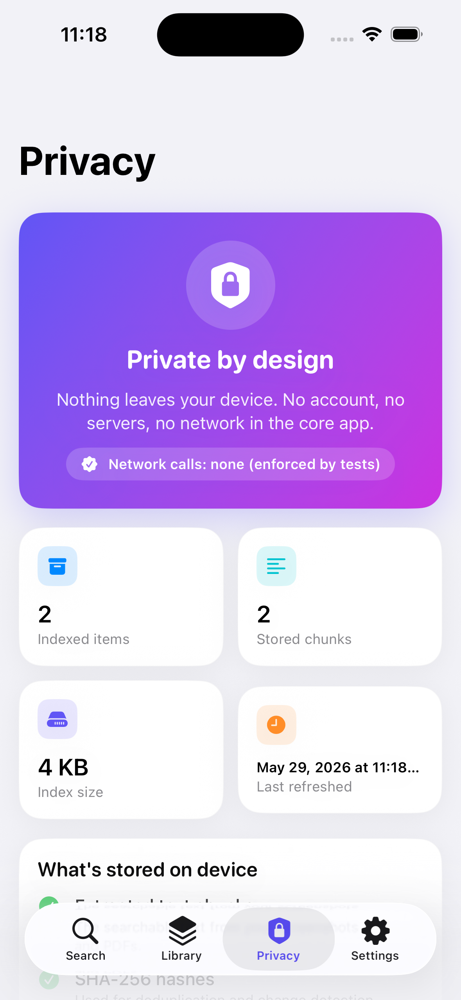

# LocalMindKit

[](https://github.com/sushildalavi/LocalMindKit/actions/workflows/ci.yml)


-success.svg)
[](LICENSE)

**Privacy-first iOS search for screenshots and imported PDFs — fully on-device.**

LocalMindKit makes your screenshots and imported PDFs searchable by **text and
phrase queries**. It extracts text on-device (Vision OCR for images, PDFKit for
documents), indexes it locally with SQLite FTS5, and returns ranked, highlighted
results. There is no backend, no account, and no network call in the core
flows — nothing leaves the device.

> Scope note (kept deliberately honest): the current build is **text and phrase
> search**, not semantic / natural-language search. Local embeddings are the
> planned next phase and will only be described as "semantic" once they
> measurably improve retrieval quality on a labeled query set.

## Screenshots

Running on iOS 26.5 (iPhone 16 simulator).

| Search | Result detail | Library | Privacy |
|:------:|:-------------:|:-------:|:-------:|
|  |  |  |  |
| Highlighted FTS5 results with relevance + sort | Full extracted text, on-device | Indexing status, sources, metrics | "Nothing leaves your device" |

## Why this design

iOS sandboxing prevents arbitrary filesystem crawling, so LocalMindKit works
through user-approved sources — **PhotoKit** for screenshots/photos and the
**document picker** for imported PDFs/text. That constraint shaped the
architecture and makes the privacy model explicit rather than incidental.

The retrieval/indexing logic lives in a dependency-free Swift package
(`LocalMindKitCore`) that builds and unit-tests on the macOS host without a
simulator. The SwiftUI app is a thin shell on top of it.

## Architecture

```
SwiftUI app (PhotoKit source · document import · @Observable view models)
      │  IngestItem(externalID, kind, data | url, dates)
      ▼
IndexCoordinator (actor): bounded TaskGroup · cancellation · progress · skip-unchanged
   ├ OCRExtractor (Vision) ┐
   ├ PDFExtractor (PDFKit) ├→ Chunker (NaturalLanguage) → Database (actor, SQLite + FTS5)
   └ TextExtractor         ┘
QueryService → Ranker (keyword bm25 + recency + type; semantic = stubbed) ← Database
```

- **Persistence:** system SQLite + FTS5 via the C API (no third-party deps),
  behind a thin tested wrapper. Stores text **chunks** and SHA-256 hashes —
  never raw image/PDF bytes. WAL journaling with tuned pragmas (busy timeout,
  in-memory temp store, page cache), `optimize()`/`vacuum()` maintenance, and
  cheap stats (index size, per-type file counts) for the privacy dashboard.
- **Retrieval:** FTS5 `MATCH` ordered by `bm25()`, with `snippet()`/`highlight()`
  for highlighted snippets. Hybrid-ready ranking (keyword + recency + type;
  semantic weight reserved for the embedding phase). Query terms are quoted and
  AND-ed before `MATCH` to avoid FTS operator injection, file-type filtering is
  pushed into SQL, and an opt-in prefix mode supports as-you-type search.
- **Concurrency:** an actor coordinator runs extraction in a bounded task group
  with cancellation, progress reporting, and incremental skip-unchanged via
  content hash.

See [`docs/ARCHITECTURE.md`](docs/ARCHITECTURE.md).

## Privacy model (MVP)

- No backend, no API keys, **no network calls** in the core engine.
- Screenshot/PDF **text** is the index; **raw bytes are never stored** in the DB.
- Local SQLite index only; excluded from iCloud backup.
- **Delete-all** removes indexed files, chunks, and FTS rows; the privacy
  dashboard shows indexed item count, index size, and last-indexed time.
- The "no network" guarantee is **enforced by a test** (`NetworkAuditTests`)
  that fails the build if any networking symbol appears in `LocalMindKitCore`.

See [`docs/PRIVACY.md`](docs/PRIVACY.md).

## Status

- **Core engine:** implemented and host-tested with an XCTest suite run on every
  CI build (FTS5 search, chunking incl. oversize-sentence splitting, ranking,
  deduplication, deletion, incremental indexing, PDF/text extraction incl. BOM
  handling, prefix/type-filtered query construction, index stats, and the
  network audit). One OCR test is skipped (needs a runtime Vision call).
- **iOS app:** SwiftUI screens + view models + PhotoKit/document sources wired
  (`App/LocalMindKitApp`). Built and run on iPhone 16 simulator (iOS 26.5),
  with visual smoke testing for the search/detail/library/privacy flows.
  Physical-device OCR throughput and memory benchmarks are still pending.

## Benchmarks

Host micro-benchmark (Apple M3, 16 GB, macOS 26.5, release build, in-memory
SQLite, 2,000 synthetic text docs / 2,000 chunks):

| Metric | Value |
|---|---|
| Keyword search latency p50 | ~1.3 ms |
| Keyword search latency p95 | ~1.4 ms |
| Indexing (chunk + FTS5 insert) | 2,000 files in 0.36 s |

**These are host engine numbers, not device numbers.** They show local FTS5
search is not the bottleneck. They **exclude OCR/PDF extraction** (the real
on-device cost), which is the subject of the planned device benchmark
(OCR ms/image, indexing throughput, memory, p95 search on persisted SQLite,
skip-unchanged re-index). See [`docs/BENCHMARKS.md`](docs/BENCHMARKS.md).

Persisted benchmark harness (JSON + doc auto-update):

```bash
bash scripts/run_benchmarks.sh \
  .benchmarks/latest.json \
  .benchmarks/persisted-index.sqlite \
  2000 \
  200

bash scripts/update_benchmarks_doc.sh .benchmarks/latest.json
```

Optional extraction timing inputs:

```bash
swift run -c release LocalMindKitBench \
  --mode run \
  --output .benchmarks/latest.json \
  --db-path .benchmarks/persisted-index.sqlite \
  --corpus-size 2000 \
  --query-runs 200 \
  --ocr-samples /absolute/path/to/ocr_samples \
  --pdf-samples /absolute/path/to/pdf_samples
```

## Quick start

```bash
swift build
swift test          # full suite; 1 OCR case skipped (needs a runtime Vision call)
```

> `swift test` needs the XCTest framework from a full Xcode install. With only
> the Command Line Tools, `swift build` works but the test suite won't — CI runs
> it on a macOS runner with Xcode.

Run the iOS app (requires full Xcode):

```bash
open LocalMindKit.xcodeproj
```

Regenerate the project from spec (optional):

```bash
brew install xcodegen && xcodegen generate
```

## Known limitations

- Current visual verification is simulator-only (iPhone 16, iOS 26.5). Physical
  device verification and profiling are still pending.
- Search is keyword-first FTS5; semantic embeddings are deferred to a later phase.
- Benchmarks are host-only so far; device OCR/indexing benchmarks are pending.

## Roadmap

1. Build and run the iOS app in Xcode; record a demo GIF (Photos permission →
   index screenshots → search → preview → privacy dashboard → delete index);
   add/update media in this README.
2. Device benchmark: OCR ms/image, indexing throughput, memory, p50/p95 search
   over persisted SQLite, at 50/100/500 screenshots.
3. On-device semantic search (local embeddings) + true hybrid ranking; claim
   "semantic" only after measured Recall@5 / MRR improvement on a labeled set.
4. V1 privacy (per-item delete, album exclusions, cache-purge verification).
```
